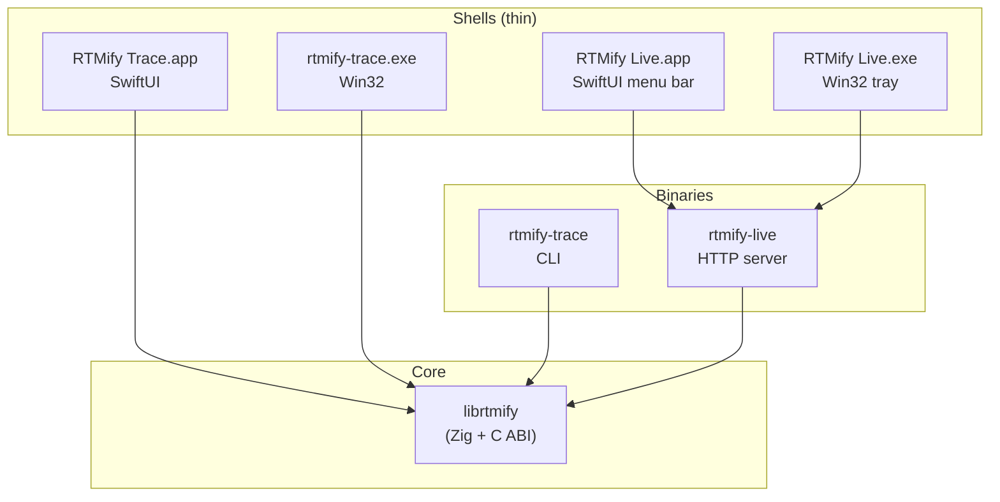

# rtmify

`rtmify` is the monorepo for the RTMify product family: a Zig-built, locally-installed toolchain that turns engineering spreadsheets and source repositories into auditable Requirements Traceability Matrices, design history files, and compliance evidence — without sending customer data anywhere.

This README is the developer and operator entrypoint. A new person should be able to use it to:

- understand what this repo is and is not
- build every product variant from a clean checkout
- run the full local test surface
- find the major modules
- understand how the products relate
- make common changes without breaking the layer boundaries
- operate the release pipeline

## What We Earned

This monorepo exists because the team consolidated several pieces of leverage that were previously scattered, fragile, or impossible:

- **One toolchain**: Zig 0.15.2 cross-compiles every binary for every target — macOS arm64/x64, Windows x64/arm64, Linux x64/arm64 — from any host. No Docker, no cross-toolchains, no SDK juggling.
- **One library, two products**: `librtmify` is the shared Zig core. `rtmify-trace` is a one-shot CLI; `rtmify-live` is a long-running HTTP server with a browser dashboard. Both link the same XLSX parser, graph engine, and license verifier.
- **One release script**: `tools/publish.py release` builds, signs, packages, dispatches GitHub Actions for the Windows installer, and uploads the final assets. No manual orchestration.
- **Local-first by construction**: Trace runs as a single binary with no network calls. Live runs as a local server with the dashboard at `localhost:8000`. Customer XLSX, repo, and license data never leaves the machine.
- **Hand-rolled native shells**: SwiftUI on macOS, Win32 on Windows. Both link `librtmify` directly. No Electron, no embedded browser, no runtime dependencies.
- **Signed offline licenses**: HMAC-signed JSON files with a fingerprinted signing key. License gates are enforced inside the Zig core, not the shells, so they cannot be bypassed by replacing the UI.

The practical result is portability, fast iteration, and a defensible local-only story for regulated customers (medical, aerospace, automotive).

## What This Is

- A Zig 0.15.2 monorepo with a single `build.zig` graph
- Two shippable products: `rtmify-trace` (CLI + native shells) and `rtmify-live` (HTTP server + native tray shells)
- One shared core library: `librtmify` (Zig static + shared lib with C ABI)
- One operator tool: `rtmify-license-gen`
- Native desktop shells in SwiftUI (macOS) and hand-rolled Win32 (Windows)
- Python release tooling that orchestrates signing, GitHub Actions dispatch, and asset publishing
- A real validation package (`validation/`) covering IQ/OQ for regulated customers
- An MCP server inside `rtmify-live` for AI tool integration

## What It Does

- parses RTMify XLSX workbooks (User Needs, Requirements, Tests, Risks, plus profile-specific tabs) into an in-memory graph
- detects requirement traceability gaps across 4 industry profiles: medical (IEC 62304), aerospace (DO-178C), automotive (ISO 26262), and generic
- renders requirements traceability matrices as PDF, DOCX, and Markdown — all from pure Zig, no external dependencies
- runs a local HTTP server with a dashboard, sync-from-Google-Sheets, repo scanning for code traceability, and an MCP transport
- verifies signed offline license files with an HMAC-fingerprinted public key
- packages signed installers for macOS (DMG) and Windows (Inno Setup via GitHub Actions)
- builds an IQ/OQ validation package for customer audit trails

## What It Does Not Do

- it does not phone home, sync to a cloud, or transmit customer data
- it is not a generic spreadsheet tool — it expects RTMify-shaped workbooks
- it does not replace the customer's Google Sheets / Excel as the source of truth; it reads from them
- it does not yet have a Linux GUI shell (Linux is CLI-only for Trace)
- it does not embed an LLM in V1 — `libllm` and `libtraveler` are parked spikes
- it does not include test results integration with every test framework — only what `live/test_results*.zig` covers
- it does not yet sign Windows installers automatically without Azure Trusted Signing credentials

## First Day

If you are new to the repo, run these in order from `sys/`:

```bash
zig build                     # native trace + live + librtmify
zig build test                # all host tests (lib + trace + live + cadcruncher + reqif + traveler)
zig build trace               # just the Trace CLI
zig build live                # just the Live HTTP server
zig build release             # cross-compile everything for all 6 targets
```

What each proves:

- `zig build`: the canonical native build links and stamps correctly
- `zig build test`: the full host-test surface passes (XLSX parsing, graph queries, schema ingestion, license verification, server routes, MCP, sync, repo scan, etc.)
- `zig build trace` / `zig build live`: the individual product binaries build cleanly
- `zig build release`: cross-compilation works for macOS arm64/x64, Windows x64/arm64, Linux x64/arm64

Then run a Live server against a freshly-generated demo database:

```bash
python3 tools/demo_fixture/generate_vitalsense_vs200_demo.py \
  --output /tmp/demo.sqlite --overwrite
./zig-out/bin/rtmify-live --db /tmp/demo.sqlite --port 8000
# open http://localhost:8000
```

## Product Matrix

| Product | Built by | Output | Native shell | Distribution |
|---|---|---|---|---|
| **rtmify-trace** (CLI) | `zig build trace` | `zig-out/bin/rtmify-trace` | none | bundled in shells |
| **RTMify Trace.app** (macOS) | `cd trace/macos && make build` | `.app` bundle | SwiftUI | DMG |
| **rtmify-trace.exe** (Win GUI) | `zig build win-gui -Dtarget=x86_64-windows` | `.exe` | Win32 | Inno Setup |
| **rtmify-live** (server) | `zig build live` | `zig-out/bin/rtmify-live` | none | bundled in shells |
| **RTMify Live.app** (macOS) | `cd live/macos && make app` | `.app` bundle | SwiftUI menu bar | DMG |
| **RTMify Live.exe** (Win tray) | `zig build win-gui-live -Dtarget=x86_64-windows` | `.exe` | Win32 tray | Inno Setup |
| **librtmify** (lib) | `zig build lib` | `.a` + `.dylib`/`.so`/`.dll` | n/a | linked into shells |
| **rtmify-license-gen** | `zig build license-gen` | `zig-out/bin/rtmify-license-gen` | none | operator-only |

Plus support libraries (built on demand, used by Live):

- `libcadcruncher` — CAD artifact metadata extractor (`zig build cadcruncher`)
- `libreqif` — ReqIF parser (`zig build reqif`)
- `libllm` — parked LLM spike (`zig build llm`); not in V1
- `libtraveler` — parked traveler spike (`zig build traveler`); not in V1

## Quick Repo Map

- `build/` — Zig build graph: artifacts, options, release, tests, types, windows, llama
- `build.zig` — entry point that wires the build/ modules together
- `lib/` — `librtmify` Zig core: graph, XLSX parser, schema, profile, render_md/docx/pdf, license, diagnostic
- `trace/` — Trace CLI source + macOS app + Windows GUI shell
- `live/` — Live HTTP server source + macOS menu bar shell + Windows tray shell + Playwright tests
- `libcadcruncher/` — CAD metadata extractor (used by Live)
- `libreqif/` — ReqIF parser (used by Live)
- `libllm/`, `libtraveler/` — parked spikes
- `tools/publish.py` — release pipeline: build, sign, package, dispatch CI, upload assets
- `tools/demo_fixture/` — VitalSense VS-200 demo database generator
- `release.sh` — operator release script (called by `publish.py`)
- `validation/` — IQ/OQ validation package generator
- `packaging/windows/` — Inno Setup templates for Windows installers
- `test/` — shared test fixtures + golden output + `publish.py` tests
- `docs/` — release operations runbook + parked spike docs
- `dist/` — release output staging (gitignored)
- `zig-out/` — Zig build output (gitignored)

## Architecture

Two products, one core. The shells are thin process managers and UI; all parsing, graph construction, license verification, and rendering live in `librtmify`.



Boundary rules:

- **Native shells** own: window/tray UI, license file picker, server lifecycle (Live only). They never parse XLSX or render reports themselves.
- **Binaries** own: argv parsing, HTTP routing (Live), CLI flow (Trace).
- **`librtmify`** owns: XLSX parsing, graph construction, profile-aware gap detection, report rendering, license verification.
- The C ABI is the only contract between shells and the core. Adding a feature to a shell that needs new core behavior means adding a new C export, not reaching into Zig internals.

For deeper architecture see:

- `lib/docs/architecture.md` — Trace/lib internals
- `live/docs/architecture.md` — Live runtime topology
- `live/docs/repo.md` — Live+Repo PRD (industry profiles, code traceability, future scope)

## Build Graph

The build graph is split into purpose-named files under `build/`:

| File | Owns |
|---|---|
| `build/types.zig` | shared `BuildCtx` |
| `build/options.zig` | version string, license HMAC key resolution |
| `build/artifacts.zig` | native build steps (trace, live, lib, license-gen, etc.) |
| `build/tests.zig` | unit test steps and coverage |
| `build/windows.zig` | Windows-specific build steps (`win-gui`, `win-gui-live`) |
| `build/release.zig` | cross-compile-everything `release` step |
| `build/llama.zig` | parked LLM build glue |
| `build/support.zig` | shared helpers |

The single `build.zig` at the root just wires these together.

To add a new build step, edit the relevant `build/*.zig` file — never inline the step into `build.zig`.

## Common Change Recipes

### Add a Trace CLI flag

Touch:

- `trace/src/main.zig` — argv parsing, help text
- `lib/src/lib.zig` — if a new C export is needed for a shell to consume the same flag
- tests in `trace/src/main.zig` or `lib/src/lib.zig` test blocks

### Add a Live HTTP route

Touch:

- `live/src/routes.zig` — handler function + route registration
- `live/src/server.zig` — only if the handler needs new server-level state
- tests in `live/tests/` (Playwright) or `live/src/server.zig` test blocks

### Add a column to the XLSX schema

Touch:

- `lib/src/schema.zig` — synonym list, ingestion code, IngestStats counter
- `lib/src/graph.zig` — if a new node type or edge label is needed
- `lib/src/render_md.zig` / `render_docx.zig` / `render_pdf.zig` — if the column should appear in reports
- `lib/src/profile.zig` — if a profile depends on the new column
- update `test/fixtures/RTMify_Requirements_Tracking_Template.xlsx` and `test/golden/golden_rtm.md`

### Add an industry profile

Touch:

- `lib/src/profile.zig` — profile definition (name, required tabs, required columns, gap rules)
- `lib/src/diagnostic.zig` — profile-specific error codes if needed
- `lib/src/render_*.zig` — profile-specific report sections if needed
- a new fixture under `test/fixtures/` covering the profile's required tabs

### Add a Live MCP tool

Touch:

- `live/src/mcp.zig` — tool definition + handler
- `lib/src/lib.zig` — only if the tool needs new core behavior via C ABI
- tests in `live/tests/`

### Add a license-gated feature

Touch:

- `lib/src/license.zig` — feature flag in the license payload schema
- `lib/src/license_file.zig` — payload field
- `lib/src/license_gen.zig` — generator-side flag
- the feature's call site (gate via `license.permitsFeature(...)`)
- never gate at the shell layer — gate inside the core

### Bump the version for a test build

Pass it on the command line:

```bash
zig build live -Dtarget=x86_64-windows -Doptimize=ReleaseSafe -Drelease-version=20260421-b
```

Or for a real release, let `tools/publish.py release` auto-bump it. Never edit `build/options.zig` manually.

## Invariants And Safety Rules

These are the rules worth protecting:

- **license verification belongs in the core, not the shell** — the shell only collects the file and asks `librtmify` to validate it
- **shells must not parse XLSX or render reports** — they call the C ABI; if you find yourself adding a parser to Swift or Win32, you are doing it wrong
- **the C ABI is the only contract between shells and the core** — never reach into Zig internals from a shell
- **the build graph lives in `build/*.zig`** — `build.zig` only wires; logic stays in named modules
- **release versions are bumped by `tools/publish.py`** — manual edits to `build/options.zig` will be overwritten
- **HMAC signing keys live outside the repo** — the canonical path is `~/.rtmify/secrets/license-hmac-key.txt`; debug builds may use a hardcoded dev key but release builds will refuse to compile without the real key
- **customer data stays local** — no telemetry, no sync, no analytics. Plausible on the marketing site is the only exception, and it lives in the separate `site/` repo
- **profile-specific behavior goes in `profile.zig`** — do not pepper profile checks across the rest of the lib
- **if you change wire formats (XLSX schema, license envelope, MCP responses), update the golden fixtures and add a test**

## Release Flow

Single command from `sys/`:

```bash
./tools/publish.py release
```

That:

1. Builds the raw release directory via `release.sh`
2. Signs and packages all platforms (macOS DMGs, Windows payload zip, Linux tarballs)
3. Creates a draft GitHub Release and uploads the Windows payload zip
4. Dispatches `windows-installer-packaging.yml` (Inno Setup on `windows-latest`)
5. Downloads unsigned installers and signs them locally
6. Generates the site download manifest (`latest.json`)
7. Uploads all final assets to the GitHub Release
8. Updates `cvillecsteele/rtmifysite` with the new manifest

Common variants:

```bash
./tools/publish.py release --windows                    # Windows only
./tools/publish.py release --version 20260421-b         # explicit version
./tools/publish.py release --skip-validation --skip-site # test build, no validation/manifest
./tools/publish.py release --dry-run                    # preview without executing
./tools/publish.py status                               # check pipeline state
```

The release stays in **draft** until you publish it manually:

```bash
gh release edit v20260421-a --repo cvillecsteele/rtmify --draft=false
```

Full operator runbook: `docs/release-operations.md`.

## Testing Surfaces

| Surface | Command | What it covers |
|---|---|---|
| Host unit tests | `zig build test` | All Zig modules: graph, xlsx, schema, profile, render, license, server routes, MCP, sync, repo scan |
| Trace CLI tests | `zig build test-trace` | CLI argv parsing, help, exit codes |
| Live unit tests | `zig build test-live` | Live-only modules: db, server, routes, mcp, sync |
| librtmify tests | `zig build test-lib` | Core library tests in isolation |
| Live E2E (Playwright) | `cd live/tests && npm test` | Browser-driven flows: lobby, license gate, RTM views, sync |
| Validation package | `cd validation && python3 package_validation.py` | IQ/OQ document generation |
| Coverage | `zig build coverage` | kcov-driven host coverage report |

The Playwright suite runs against a freshly-seeded test database via `live/tests/helpers/db-seed.ts` and a server started by `live/tests/helpers/server.ts`.

## Demo Database

For a populated DB to develop against, generate the VitalSense VS-200 fixture:

```bash
python3 tools/demo_fixture/generate_vitalsense_vs200_demo.py \
  --output /tmp/demo.sqlite \
  --artifact-dir /tmp/demo-artifacts \
  --overwrite
./zig-out/bin/rtmify-live --db /tmp/demo.sqlite --port 8000
```

The fixture seeds 47 production units, complete requirement traceability, test results, SOUP components, and design artifacts — no Sheets sync or repo integration required.

Full details: `tools/demo_fixture/README.md`.

## Troubleshooting

### `zig: command not found`

Install Zig 0.15.2: `brew install zig` on macOS, or download from [ziglang.org](https://ziglang.org/download/). Older or newer versions will not build cleanly.

### Release build fails with `release builds require -Dlicense-hmac-key-file...`

You're missing the HMAC signing key. Either:

- pass `-Dlicense-hmac-key-file=/path/to/key.txt` on the command line
- set `RTMIFY_LICENSE_HMAC_KEY_FILE` in your environment
- create `~/.rtmify/secrets/license-hmac-key.txt` with exactly 64 lowercase hex chars

Debug builds (`-Doptimize=Debug`) use a hardcoded dev key and don't need this.

### `Undefined symbols: ___divtf3` (macOS linker error)

The Zig static library was built without bundling compiler-rt. Ensure `static_lib.bundle_compiler_rt = true;` is present in `build/artifacts.zig`. This is required because Zig's JSON parser uses f128 builtins internally.

### Windows `.exe` shows mojibake (`ΓÇö` instead of `—`)

The console codepage isn't UTF-8. `rtmify-live.exe` calls `SetConsoleOutputCP(65001)` at startup, but legacy `cmd.exe` may need `chcp 65001` run manually first. PowerShell and Windows Terminal handle this correctly.

### `publish.py release --windows` waits forever for CI

Check the GitHub Actions workflow status: `gh run list --repo cvillecsteele/rtmify --workflow=windows-installer-packaging.yml`. The dispatch may have failed silently if `gh` isn't authenticated.

### macOS app won't notarize

Verify `APPLE_SIGNING_IDENTITY`, `RTMIFY_NOTARY_KEY_FILE`, `RTMIFY_NOTARY_KEY_ID`, and `RTMIFY_NOTARY_ISSUER_UUID` are set. Check the keychain: `security find-identity -v -p codesigning`.

## Current Status

Working today:

- `zig build` → native Trace + Live + lib build clean
- `zig build test` → all host tests pass
- `zig build release` → cross-compiles for all 6 targets
- macOS app builds for Trace and Live
- Windows GUI builds for Trace and tray shell builds for Live
- `tools/publish.py release` → end-to-end release pipeline
- VitalSense demo fixture generator
- IQ/OQ validation package generator
- MCP server inside Live
- Code traceability via repo scan + git blame
- 4 industry profiles: medical, aerospace, automotive, generic

Still intentionally incomplete:

- no Linux GUI shell (CLI only)
- no auto-update for installed shells
- Windows installer signing requires Azure Trusted Signing credentials (no fallback)
- LLM/traveler spikes (`libllm`, `libtraveler`) are parked, not productized
- Live macOS shell does not yet have full crash-restart parity with the Windows tray shell
- some test result formats (xUnit, TAP) not yet integrated
- ReqIF integration is parser-only; no UI surface yet

## Additional Docs

- Release operations runbook: `docs/release-operations.md`
- Trace/lib architecture: `lib/docs/architecture.md`
- Live runtime architecture: `live/docs/architecture.md`
- Live BOM/SOUP ingestion: `live/docs/bom_ingestion.md`
- Live MCP protocol: `live/docs/mcp.md`
- Live+Repo PRD: `live/docs/repo.md`
- Trace macOS shell: `trace/macos/README.md`
- Trace Windows shell: `trace/windows/README.md`
- Live macOS shell: `live/macos/README.md`
- Live Windows shell: `live/windows/README.md`
- Demo database: `tools/demo_fixture/README.md`
- Validation package: `validation/README.md`
- Core library: `lib/README.md`
- Trace CLI: `trace/README.md`

## Reference

The marketing site lives in a separate repo at `cvillecsteele/rtmifysite` and publishes the download manifest at `https://rtmify.io/downloads/latest.json`. The local checkout is at `/Users/colinsteele/Projects/rtmify/site/`.
